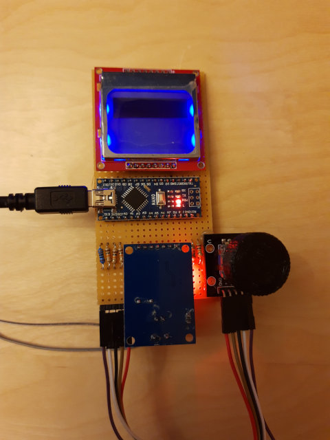
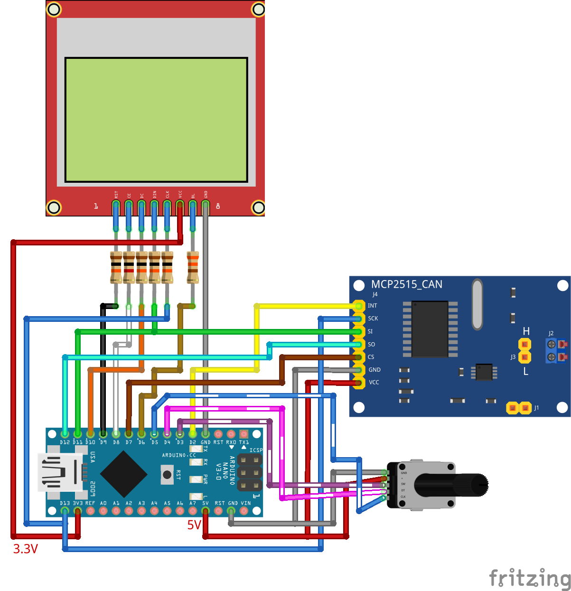
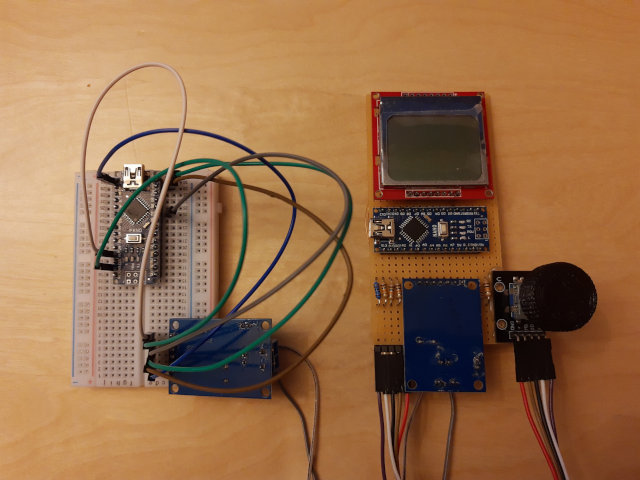
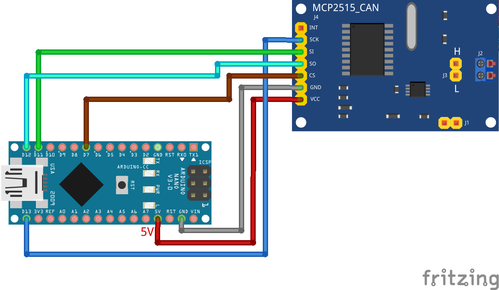
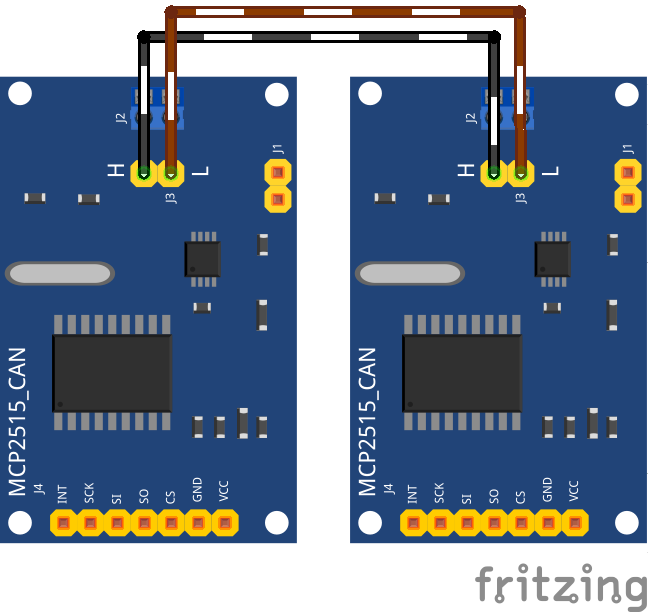

# PCD8544\_over\_CAN (Nokia 5110 LCD)

This application allows to remote control the Nokia 5110 / PCD8544 LCD pixels
via CAN bus by using an Arduino Nano. It features a rotary encoder with an
integrated button and is able to read the current ATmega temperature and
voltage.

## Thank you

  * ATmega Temperature: http://www.avrfreaks.net/forum/328p-internal-temperature
  * ATmega Voltage: https://code.google.com/archive/p/tinkerit/wikis/SecretVoltmeter.wiki
  * Button Debounce: https://www.instructables.com/id/Arduino-Dual-Function-Button-Long-PressShort-Press/
  * Rotary Encoder: http://www.mathertel.de/Arduino/RotaryEncoderLibrary.aspx
  * MCP2515 CAN: https://github.com/autowp/arduino-mcp2515
  * PCD8544 Display: https://www.e-tinkers.com/2017/11/how-to-use-lcd-5110-pcd-8544-with-arduino/
  * Display Wiring: https://eldontronics.wordpress.com/2018/03/01/driving-the-nokia-5110-display-with-arduino-no-external-library/

## MIT License

See LICENSE file for details.

## Hardware

  * Arduino Nano
  * Nokia 5110 Display (in my version the backlight is GND controlled)
  * MCP2515 CAN Module
  * Rotary Encoder with Push Switch
  * Resistors: 4x 10 kOhm (Data), 1x 1 kOhm (Chip Enable), 1x 330 Ohm (Backlight)

## Wiring

## Example

A simple test if the setup works can be found as sketch in the folder example.
After connection the CAN lines of both MCP2515 boards (H = H, L = L) the
display should fill with pixels and gets cleared when its full. It also flashes
the backlight and requests the current voltage and temperature values. If the
rotary encoder is turned the received CAN frames are also shown as serial
output, including a detection if the push button is pressed longer.

### Hardware

  * Arduino Nano
  * MCP2515 CAN Module

### CAN-only Wiring

### CAN-Bus Connection

## CAN Frames

### 1 - Status Update

Whenever the rotary encoder is turned or the push button is pressed the device
emits a status update frame. It is also send when the button is released.

Content:
  * ID: RD\_CAN\_REMOTE\_ID
  * DLC: 3
  * Data 0: 0x01
  * Data 1: rotation direction (negative = counterclockwise, positive = clockwise, 0 = not rotated)
  * Data 2: button state (0 = not pressed, 1 = pressed, 2 = long pressed)

### 2 - Temperature and Voltage Request

Request the temperature and voltage from the device. The temperature is
multiplied by 10, eg. 249 is 24.9 °C. Voltage is in mV.

Request frame:
  * ID: RD\_CAN\_LOCAL\_ID
  * DLC: 1
  * Data 0: 0x02

Answer frame:
  * ID: RD\_CAN\_REMOTE\_ID
  * DLC: 5
  * Data 0: 0x02
  * Data 1: temperature >> 8
  * Data 2: temperature & 0xff
  * Data 3: voltage >> 8
  * Data 4: voltage & 0xff

### 3 - Backlight Brightness

Set the display brightness, the value ranges from 0 to 255. Zero is full brightness and 255 is off.

Request frame:
  * ID: RD\_CAN\_LOCAL\_ID
  * DLC: 2
  * Data 0: 0x03
  * Data 1: brightness value

### 4 - Clear Display

Clear the display content.

Request frame:
  * ID: RD\_CAN\_LOCAL\_ID
  * DLC: 1
  * Data 0: 0x04

### 5 - Set Pixel

Set a pixel at the given position.

Request frame:
  * ID: RD\_CAN\_LOCAL\_ID
  * DLC: 3
  * Data 0: 0x05
  * Data 1: X-Position (0 to 83)
  * Data 2: Y-Position (0 to 47)
